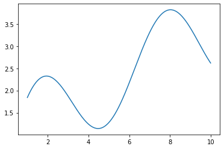
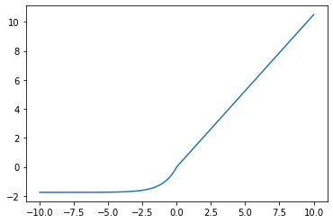
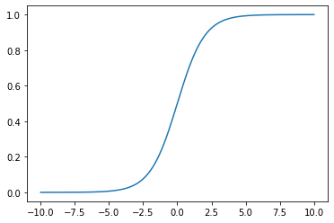

```python
import jax
import jax.numpy as jnp
from jax import jit, grad, vmap, pmap
import numpy as np
from matplotlib import pyplot as plt
```


```python
x_np = np.linspace(1, 10, 1000)
y_np = np.sin(x_np) + x_np ** 0.5
plt.plot(x_np, y_np)
plt.show()
```


    

    


```python
x_jnp = jnp.linspace(1, 10, 1000)
y_jnp = jnp.sin(x_jnp) + x_jnp ** 0.5
plt.plot(x_jnp, y_jnp)
plt.show()
```


    

    


```python
from jax.example_libraries import stax
```


```python
dir(stax)
```


    ['AvgPool',
     'BatchNorm',
     'Conv',
     'Conv1DTranspose',
     'ConvTranspose',
     'Dense',
     'Dropout',
     'Elu',
     'Exp',
     'FanInConcat',
     'FanInSum',
     'FanOut',
     'Flatten',
     'Gelu',
     'GeneralConv',
     'GeneralConvTranspose',
     'Identity',
     'LeakyRelu',
     'LogSoftmax',
     'MaxPool',
     'Relu',
     'Selu',
     'Sigmoid',
     'Softmax',
     'Softplus',
     'SumPool',
     'Tanh',
     '__builtins__',
     '__cached__',
     '__doc__',
     '__file__',
     '__loader__',
     '__name__',
     '__package__',
     '__spec__',
     '_normalize_by_window_size',
     '_pooling_layer',
     'elementwise',
     'elu',
     'functools',
     'gelu',
     'glorot',
     'glorot_normal',
     'jnp',
     'lax',
     'leaky_relu',
     'log_softmax',
     'logsoftmax',
     'normal',
     'ones',
     'op',
     'parallel',
     'randn',
     'random',
     'relu',
     'selu',
     'serial',
     'shape_dependent',
     'sigmoid',
     'softmax',
     'softplus',
     'standardize',
     'zeros']


### Check if using GPU


```python
jax.default_backend()
```


    'gpu'


```python
jax.devices()
```


    [GpuDevice(id=0, process_index=0), GpuDevice(id=1, process_index=0)]


```python
jax.lib.xla_bridge.default_backend()
```


    'gpu'


```python
jax.lib.xla_bridge.device_count()
```


    2


```python
seed = 0
key = jax.random.PRNGKey(seed)

x = jax.random.normal(key, (10,))
print(type(x), x)
```

    <class 'jaxlib.xla_extension.DeviceArray'> [-0.3721109   0.26423115 -0.18252768 -0.7368197  -0.44030377 -0.1521442
     -0.67135346 -0.5908641   0.73168886  0.5673026 ]


```python
size = 5000

x_jnp = jax.random.normal(key, (size, size), dtype=jnp.float32)
x_np = np.random.normal(size=(size, size)).astype(np.float32)
```


```python
%timeit jnp.dot(x_jnp, x_jnp.T).block_until_ready()
%timeit np.dot(x_np, x_np.T)
%timeit jnp.dot(x_np, x_np.T).block_until_ready()
```

    27.8 ms ± 131 µs per loop (mean ± std. dev. of 7 runs, 1 loop each)
    355 ms ± 780 µs per loop (mean ± std. dev. of 7 runs, 1 loop each)
    120 ms ± 14.6 ms per loop (mean ± std. dev. of 7 runs, 1 loop each)


```python
%timeit jnp.dot(x_jnp, x_jnp.T)
```

    28.1 ms ± 130 µs per loop (mean ± std. dev. of 7 runs, 100 loops each)


### Demonstrate `jit` 


```python
size = 1000

x_jnp = jax.random.normal(key, (size, size), dtype=jnp.float32)
```


```python
def selu(x, alpha=1.67, lmbda=1.05):  # note: SELU is an activation function
    return lmbda * jnp.where(x > 0, x, alpha * jnp.exp(x) - alpha)

def sigmoid(x):
    return 1/(1 + jnp.exp(-x))


def dot_pdt(x, y):
    return jnp.dot(x, y.T)

def add(x, y):
    return jnp.add(x, y) * jnp.exp(x) - 2.05 + y * 0.56

# Simple helper visualization function
def visualize_fn(fn, l=-10, r=10, n=1000):
    x = np.linspace(l, r, num=n)
    y = fn(x)
    plt.plot(x, y); plt.show()
```


```python
#%timeit dot_pdt(x_jnp, x_jnp).block_until_ready()
#%timeit dot_pdt(x_jnp, x_jnp)
sigmoid_jit = jit(sigmoid)
selu_jit = jit(selu)
add_jit = jit(add)
visualize_fn(selu)
visualize_fn(sigmoid)
```


    

    


    

    


```python
data = jax.random.normal(key, (1000000,))


print('non-jit version:')
%timeit selu(data).block_until_ready()
```

    non-jit version:
    1.42 ms ± 163 µs per loop (mean ± std. dev. of 7 runs, 1 loop each)


```python
print('jit version:')
%timeit selu_jit(data).block_until_ready()
```

    jit version:
    82.2 µs ± 24.4 µs per loop (mean ± std. dev. of 7 runs, 1 loop each)


```python
print('non-jit version:')
%timeit sigmoid(data).block_until_ready()
print("jit version")
%timeit sigmoid_jit(data).block_until_ready()
```

    non-jit version:
    488 µs ± 33.2 µs per loop (mean ± std. dev. of 7 runs, 1 loop each)
    jit version
    43.3 µs ± 206 ns per loop (mean ± std. dev. of 7 runs, 10000 loops each)


```python
print('non-jit version')
%timeit add(data, data).block_until_ready()
```

    non-jit version
    292 µs ± 10.1 µs per loop (mean ± std. dev. of 7 runs, 1000 loops each)


```python
print('jit version')
%timeit add_jit(data, data).block_until_ready()
```

    jit version
    104 µs ± 24.6 µs per loop (mean ± std. dev. of 7 runs, 1 loop each)


```python

```
